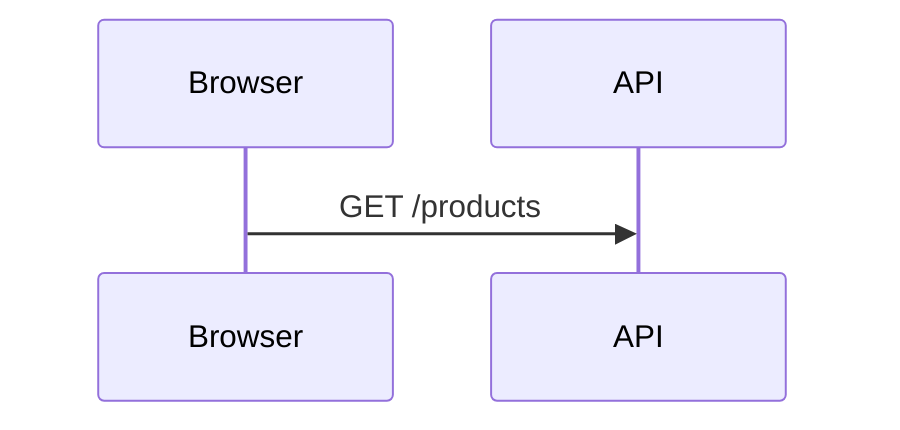
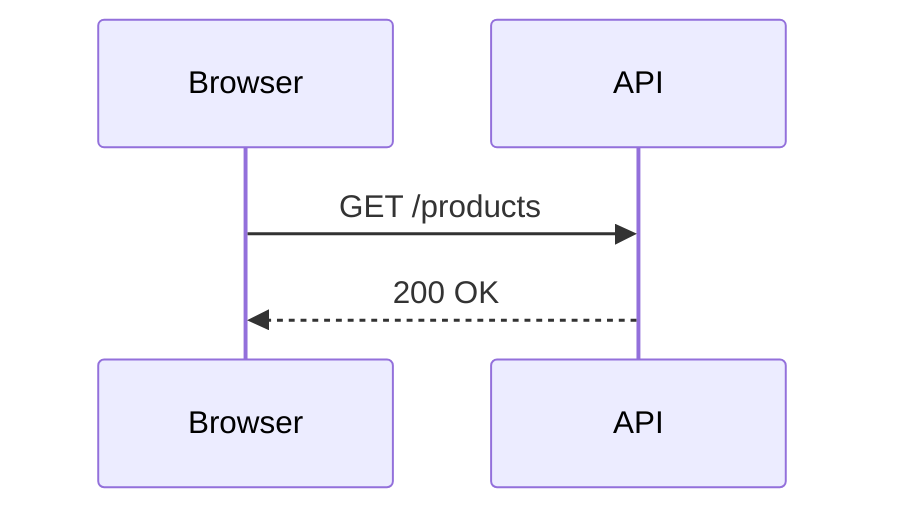

# Sequence Flow

Sequence Flow is a small, open-source developer primitive from [Canadian AI](https://canadian-ai.ca) for rendering Mermaid `sequenceDiagram` syntax as an interactive React Flow canvas and chaining multiple diagrams into progressive journeys.

It is intentionally narrow: install the component into a React application, pass Mermaid text to `SequenceDiagram` or a `JourneySlide[]` to `JourneyPlayer`, and render readable technical flows with pan, zoom, hover highlighting, activation bars, return messages, notes, self-messages, grouping boxes, and guided walkthroughs.

## Install

The canonical install path is the public GitHub source registry:

```bash
npx shadcn@latest add canadian-ai/sequence-flow/sequence-diagram
```

The shadcn CLI reads this repository's root `registry.json` directly, so the GitHub repository is the source of truth and no hosted registry runtime is required.

For compatibility with older links and existing integrations, the hosted registry item remains available:

```bash
npx shadcn@latest add https://sequence-flow.canadian-ai.app/r/sequence-diagram.json
```

You can inspect the source-registry item before installing it:

```bash
npx shadcn@latest view canadian-ai/sequence-flow/sequence-diagram
npx shadcn@latest add canadian-ai/sequence-flow/sequence-diagram --dry-run
```

## Pass a sequence flow

Use `SequenceDiagram` in any height-constrained container:

```tsx
import { SequenceDiagram } from "@/components/ui/sequence-diagram"

const chart = `sequenceDiagram
    participant B as Browser
    participant S as Server
    B->>S: Request
    S-->>B: Response`

export function Example() {
  return (
    <div className="h-[400px]">
      <SequenceDiagram chart={chart} />
    </div>
  )
}
```

## Pass a journey as JSON / TypeScript

A journey is an array of `JourneySlide` objects. Each slide owns a standalone Mermaid sequence diagram plus optional title, caption, and per-message commentary.

```tsx
import {
  JourneyPlayer,
  type JourneySlide,
} from "@/components/ui/sequence-diagram"

const journey: JourneySlide[] = [
  {
    id: "request",
    title: "Step 1 — Request",
    caption: "The browser sends a request to the API.",
    chart: `sequenceDiagram
      participant B as Browser
      participant A as API
      B->>A: GET /products`,
  },
  {
    id: "response",
    title: "Step 2 — Response",
    caption: "The API returns the result to the browser.",
    chart: `sequenceDiagram
      participant B as Browser
      participant A as API
      B->>A: GET /products
      A-->>B: 200 OK`,
  },
]

export function JourneyExample() {
  return <JourneyPlayer slides={journey} />
}
```

You can also provide `messageCaptions` on each slide when you want narration to appear as individual messages reveal.

## Write a journey in Markdown

`parseJourneyMarkdown` lets you author the same `JourneySlide[]` model in a readable Markdown document. Each `##` heading becomes a slide, ordinary Markdown becomes the slide caption, and a fenced `mermaid` block contains the diagram.

````md
# Request lifecycle

A progressive walkthrough for the request path.

## Step 1 — Request
<!-- @id: request -->
<!-- @message: The browser sends the request to the API. -->
The browser begins the request lifecycle.



## Step 2 — Response
<!-- @id: response -->
<!-- @message: The browser sends the request to the API. -->
<!-- @message: The API returns the product payload. -->
The response completes the round trip.


````

Then compile and render it:

```tsx
import {
  JourneyPlayer,
  parseJourneyMarkdown,
} from "@/components/ui/sequence-diagram"

const markdown = `...`
const journey = parseJourneyMarkdown(markdown)

export function JourneyExample() {
  return <JourneyPlayer slides={journey.slides} />
}
```

Supported Markdown annotations:

- `<!-- @id: stable-id -->` sets the slide ID.
- Repeated `<!-- @message: narration -->` annotations populate `messageCaptions` in reveal order.
- `<!-- @caption: narration -->` is accepted as an alias for `@message`.
- A top-level `#` heading is returned as the document title.
- Text before the first slide is returned as the document description.

If `messageCaptions` is omitted, `JourneyPlayer` can still reuse `%% tooltip:` annotations inside Mermaid as step commentary.

## Live editor

The demo site includes two mobile-responsive editor tabs:

- **Sequence flow** — edit Mermaid sequence syntax, preview the canvas, tune the theme, and export the diagram.
- **Journey** — switch between **Markdown** and **JSON**, preview the progressive walkthrough, choose a live theme, and copy the full React usage.

The code views are designed for full copy-and-paste usage so the rendered example and the integration snippet stay next to each other.

## Test suite

The repository includes regression coverage for the public component surface:

- sequence parser behavior and Mermaid annotations
- journey Markdown parsing and validation
- layout graph generation and reveal scheduling
- shadcn registry completeness for the Journey runtime
- browser smoke coverage for the Journey editor and theme controls

Run the unit/integration suite with:

```bash
pnpm test
```

Validate the GitHub source registry with:

```bash
pnpm exec shadcn registry validate canadian-ai/sequence-flow
pnpm exec shadcn view canadian-ai/sequence-flow/sequence-diagram
pnpm exec shadcn add canadian-ai/sequence-flow/sequence-diagram --dry-run --yes
```

Run browser smoke tests with:

```bash
pnpm dlx playwright@1.54.2 install chromium
pnpm test:e2e
```

The GitHub Actions workflow validates the source registry, performs a dry-run consumer install, runs unit/integration tests, builds the production Next.js app, and runs browser smoke coverage for every pull request.

## Distribution model

- `registry.json` at the repository root is the canonical source registry.
- `canadian-ai/sequence-flow/sequence-diagram` is the preferred public install address.
- `public/r/*.json` remains published as a compatibility layer for existing hosted-registry URLs.
- New documentation and UI should point to the GitHub source registry rather than the hosted JSON endpoint.

## What this repo is

- A reusable React component for technical diagrams.
- A progressive journey player for multi-step technical walkthroughs.
- A Markdown-to-`JourneySlide[]` compiler for annotated journey documents.
- A small Mermaid-compatible parser and layout layer for sequence diagrams.
- A shadcn GitHub source registry developers can install directly into their applications.
- A demo playground for testing diagrams, journeys, and the component API.

## What this repo is not

- A hosted diagramming SaaS.
- A project-management or collaboration product.
- A backend service or proprietary Canadian AI runtime.
- Documentation for Canadian AI's private platform internals.

The public repository contains only the generic developer-facing primitive. Canadian AI's internal runtime, application architecture, and proprietary platform implementation remain in private repositories.

## Supported syntax

Sequence Flow supports the most common `sequenceDiagram` primitives:

- `participant` and `actor`
- synchronous and asynchronous messages
- dashed return messages
- activation and deactivation bars
- self-messages
- notes
- participant grouping boxes

Unsupported control-flow blocks are ignored gracefully so partial diagrams can still render.

## Development

```bash
pnpm install
pnpm dev
```

Open `http://localhost:3000` to use the playground.

## License

MIT © 2026 Canadian AI Solutions Inc. See [LICENSE](./LICENSE).
