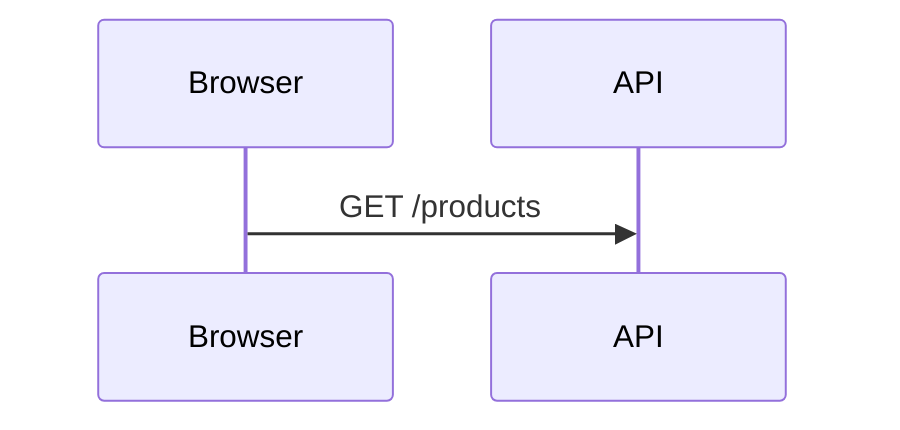

# Sequence Diagram + Journey Player (React Flow)

A lightweight developer primitive built on [`@xyflow/react`](https://reactflow.dev).
Single diagrams use Mermaid-flavored `sequenceDiagram` syntax; progressive
walkthroughs use `JourneyPlayer` with either `JourneySlide[]` data or annotated
Markdown compiled by `parseJourneyMarkdown`.

This skill documents only the public developer primitive. It does not describe
or depend on Canadian AI's private runtime or internal application architecture.

## Installation

```bash
npx shadcn@latest add https://sequence-flow.canadian-ai.app/r/sequence-diagram.json
```

This installs the component under `components/ui/sequence-diagram/`, adds the
`@xyflow/react` dependency, and writes the `--seq-*` theme tokens into your
global CSS.

## Basic sequence usage

```tsx
import { SequenceDiagram } from "@/components/ui/sequence-diagram"

const chart = `sequenceDiagram
    participant B as Browser
    participant S as Server
    B->>S: Request
    S-->>B: Response`

export function Example() {
  return <div className="h-[400px]"><SequenceDiagram chart={chart} /></div>
}
```

The component fills its parent, so always give the wrapper an explicit height.

## Progressive journey usage

```tsx
import { JourneyPlayer, type JourneySlide } from "@/components/ui/sequence-diagram"

const journey: JourneySlide[] = [
  {
    id: "request",
    title: "Request",
    caption: "The browser calls the API.",
    chart: `sequenceDiagram
      participant B as Browser
      participant A as API
      B->>A: GET /products`,
  },
]

export function JourneyExample() {
  return <JourneyPlayer slides={journey} />
}
```

## Annotated Markdown journeys

Prefer Markdown when the walkthrough should be easy for humans or coding agents
to author and review. Each `##` section is one slide. Plain Markdown inside the
section becomes the slide caption; a fenced `mermaid` block becomes its chart.

````md
# Request lifecycle

## Step 1 — Request
<!-- @id: request -->
<!-- @message: The browser sends the request. -->
The browser starts the request lifecycle.


````

Compile it before rendering:

```tsx
import { JourneyPlayer, parseJourneyMarkdown } from "@/components/ui/sequence-diagram"

const document = parseJourneyMarkdown(markdown)

export function JourneyExample() {
  return <JourneyPlayer slides={document.slides} />
}
```

Annotations:

- `<!-- @id: stable-id -->` sets a stable slide ID.
- Repeated `<!-- @message: narration -->` values become `messageCaptions` in reveal order.
- `<!-- @caption: narration -->` is accepted as an alias for `@message`.
- A top-level `#` heading becomes the journey document title.
- Text before the first `##` becomes the journey document description.

## Supported Mermaid syntax

The parser implements the most common `sequenceDiagram` features:

| Feature             | Syntax                                               |
| ------------------- | ---------------------------------------------------- |
| Participant         | `participant A as Alice`                             |
| Actor (person)      | `actor U as User`                                    |
| Sync message        | `A->>B: text`                                        |
| Async message       | `A-)B: text`                                         |
| Return message      | `B-->>A: text`                                       |
| Lost message        | `A-xB: text`                                         |
| Activate target     | `A->>+B: text`                                       |
| Deactivate source   | `B-->>-A: text`                                      |
| Explicit activation | `activate B` / `deactivate B`                        |
| Self message        | `A->>A: text`                                        |
| Note                | `Note left of A: text`, `Note right of A`, `Note over A,B` |
| Grouping box        | `box Label` … participants … `end`                   |

Lines that are not recognized (for example `loop`, `alt`, or `opt` blocks) are
ignored gracefully rather than throwing, so partial diagrams still render.

## Theming

Both `SequenceDiagram` and `JourneyPlayer` inherit CSS variables from their
wrapper:

- `--seq-accent` / `--seq-accent-foreground`
- `--seq-activation`
- `--seq-lifeline`
- `--seq-group`

Everything else uses standard shadcn tokens (`--card`, `--border`,
`--muted-foreground`, …).

## Public component architecture

- `types.ts` — parsed diagram model and option types.
- `parser.ts` — Mermaid text to sequence model.
- `layout.ts` — graph layout and reveal scheduling.
- `nodes.tsx` / `edges.tsx` — React Flow renderers.
- `context.tsx` / `tooltip.tsx` — shared interaction and annotation UI.
- `sequence-diagram.tsx` — `<SequenceDiagram />`.
- `journey-player.tsx` — `<JourneyPlayer />` and `JourneySlide`.
- `journey-markdown.ts` — Markdown to `JourneySlide[]` compiler.

## Notes for coding agents

- Always wrap `<SequenceDiagram />` in a height-constrained container.
- Keep the component read-only; author by changing Mermaid, journey JSON, or journey Markdown.
- For narrated walkthroughs, prefer `@message` Markdown annotations or Mermaid `%% tooltip:` annotations over duplicating explanation data elsewhere.
- The parser is forgiving: unknown Mermaid control-flow blocks are skipped, not errors.
